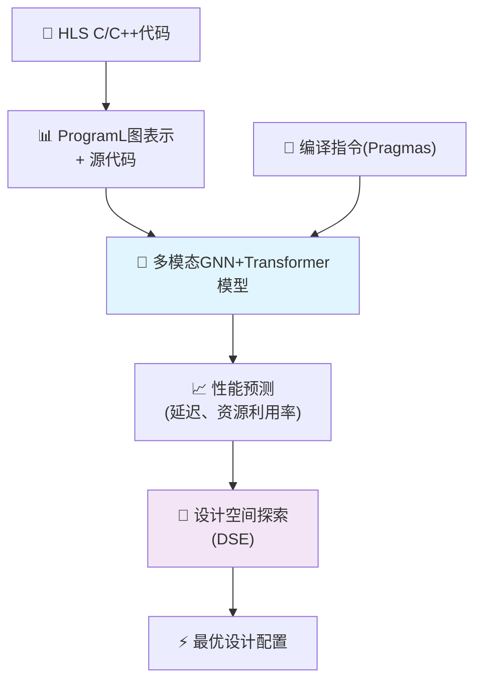
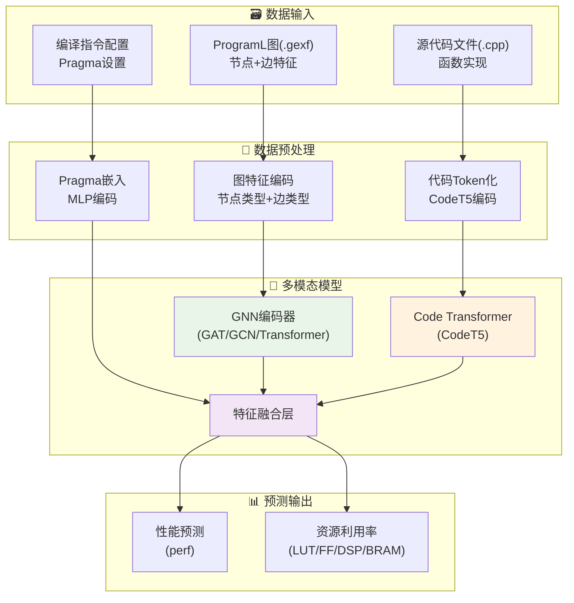
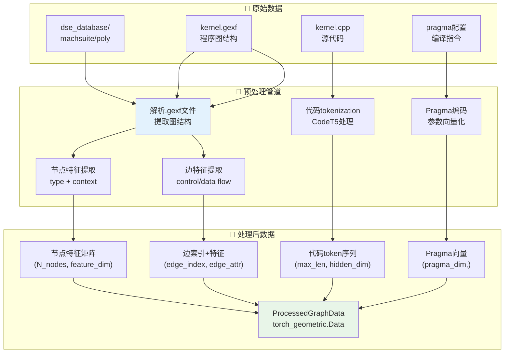
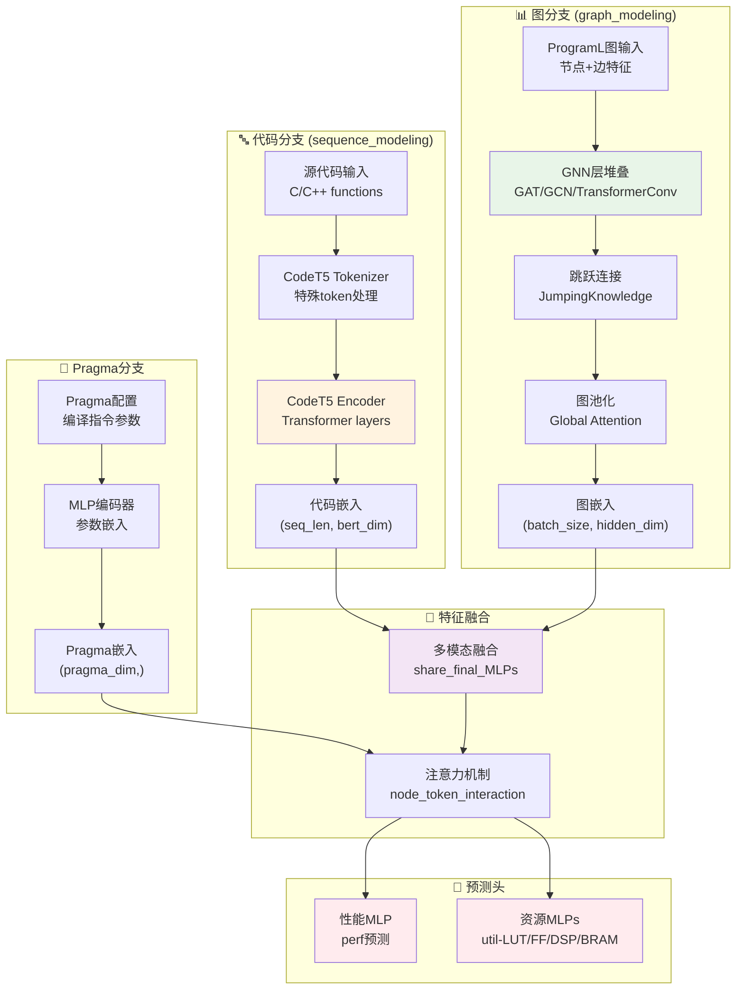
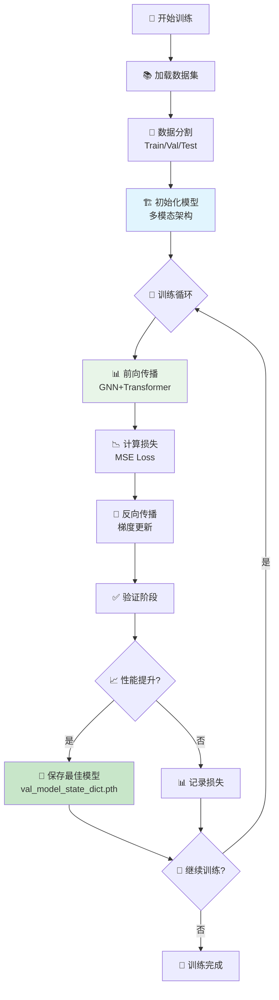
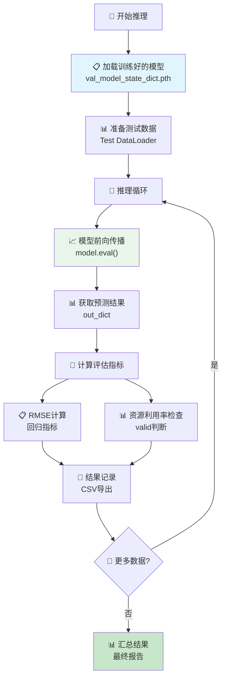
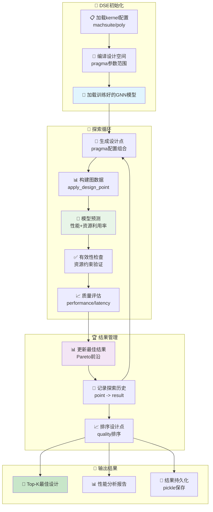

# ProgSG 项目架构概览

ProgSG是一个基于图神经网络的高层次综合(HLS)设计空间探索项目，旨在预测FPGA设计的性能和资源利用率。

## 项目概述

## 核心架构

## 数据处理流程

## 模型架构详解

## 训练流程

## 推理流程

## 设计空间探索(DSE)流程

## 关键技术特性

### 🧠 多模态架构
- **图神经网络**: GAT/GCN/TransformerConv处理程序图结构
- **代码Transformer**: CodeT5编码源代码语义
- **Pragma嵌入**: MLP编码编译指令参数

### 📊 预测目标
- **性能指标**: 延迟(perf)预测
- **资源利用率**: LUT/FF/DSP/BRAM使用率
- **有效性检查**: 资源约束验证

### 🔄 训练策略
- **多目标学习**: 同时预测多个指标
- **损失函数**: MSE Loss for regression
- **模型保存**: 基于验证集性能的最佳模型选择

### 🎯 DSE算法
- **穷举搜索**: ExhaustiveExplorer
- **有效性剪枝**: 资源约束过滤
- **质量评估**: 基于性能的设计点排序

## 配置选项

### 🛠️ 主要标志位
- `subtask`: "train"/"inference"/"dse" - 选择运行模式
- `model`: "our" - 使用多模态架构
- `sequence_modeling`: True - 启用代码建模
- `multi_modality`: True - 启用多模态融合
- `disable_gnn`: False - 是否禁用GNN
- `disable_src_code`: False - 是否禁用源代码分支

### 📁 数据配置
- `v_db`: "v21" - 数据库版本
- `dataset`: "programl" - 数据集类型
- `graph_type`: 程序图类型
- `batch_size`: 训练批次大小

### 🧠 模型配置
- `gnn_type`: "gat"/"gcn"/"transformer" - GNN类型
- `code_encoder`: "codet5" - 代码编码器
- `D`: 隐藏层维度
- `epoch_num`: 训练轮数 